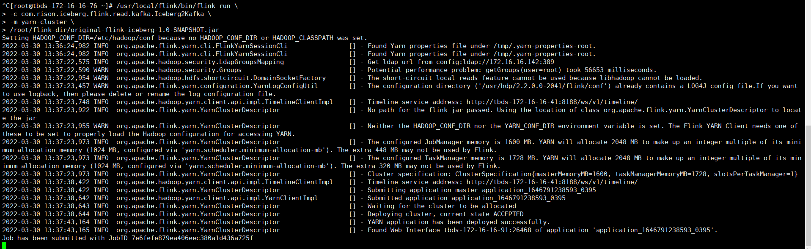
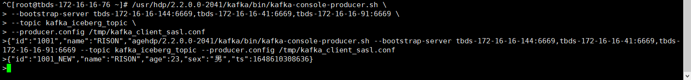
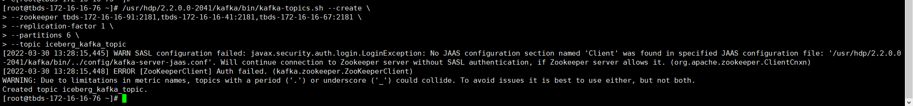
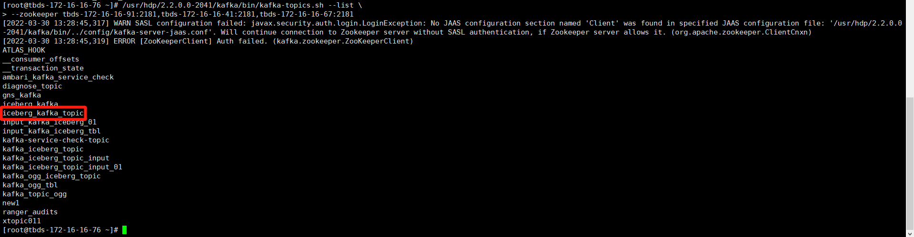
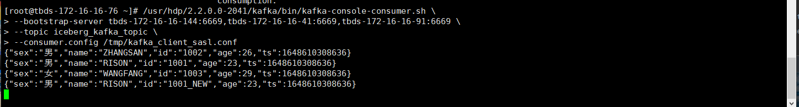

## Flink 实现流式读 iceberg2kafka

### 1. flink执行脚本

#### 1.1 执行脚本

``````shell
/usr/local/flink/bin/flink run \
-c com.rison.iceberg.flink.read.kafka.Iceberg2Kafka \
-m yarn-cluster \
/root/flink-dir/original-flink-iceberg-1.0-SNAPSHOT.jar
``````



#### 1.2 手动插入数据

``````sql
# SASL_PLAINTEXT 认证
vim /tmp/kafka_client_sasl.conf

security.protocol=SASL_PLAINTEXT
sasl.mechanism=PLAIN

# 生产数据
/usr/hdp/2.2.0.0-2041/kafka/bin/kafka-console-producer.sh \
--bootstrap-server tbds-172-16-16-144:6669,tbds-172-16-16-41:6669,tbds-172-16-16-91:6669 \
--topic kafka_iceberg_topic \
--producer.config /tmp/kafka_client_sasl.conf

# JSON数据
{"id":"1001_NEW","name":"RISON","age":23,"sex":"男","ts":1648610308636}
``````



### 2.  kafka 操作脚本

#### 2.1 创建kafka topic

``````shell
# 创建topic
/usr/hdp/2.2.0.0-2041/kafka/bin/kafka-topics.sh --create \
--zookeeper tbds-172-16-16-91:2181,tbds-172-16-16-41:2181,tbds-172-16-16-67:2181 \
--replication-factor 1 \
--partitions 6 \
--topic iceberg_kafka_topic

# 查看topic
/usr/hdp/2.2.0.0-2041/kafka/bin/kafka-topics.sh --list \
--zookeeper tbds-172-16-16-91:2181,tbds-172-16-16-41:2181,tbds-172-16-16-67:2181
``````





#### 2.2 监控消费kafka topic

``````shell
# SASL_PLAINTEXT 认证
vim /tmp/kafka_client_sasl.conf

security.protocol=SASL_PLAINTEXT
sasl.mechanism=PLAIN

# 消费数据
/usr/hdp/2.2.0.0-2041/kafka/bin/kafka-console-consumer.sh \
--bootstrap-server tbds-172-16-16-144:6669,tbds-172-16-16-41:6669,tbds-172-16-16-91:6669 \
--topic iceberg_kafka_topic \
--consumer.config /tmp/kafka_client_sasl.conf
``````




